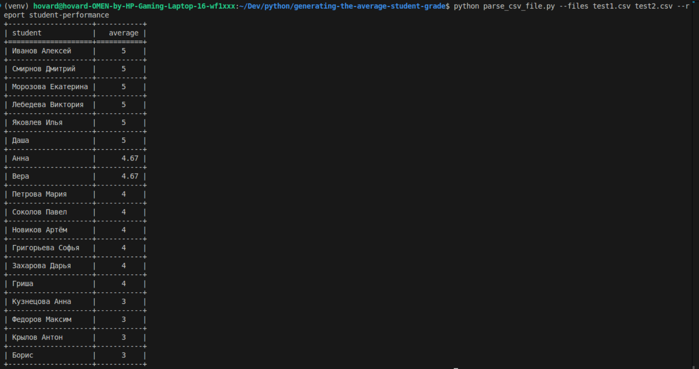
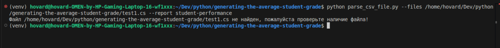
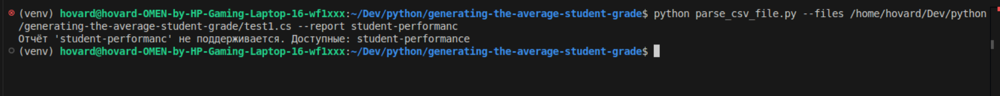

Скрипт для генерации отчётов об успеваемости студентов на основе CSV-файлов.

Скрипт написан с поддержкой добавления новых отчетов через написание 
дополнительных функций и внесение этих функций в словарь reports в формате - "student-performance": generate_student_report,
и просто заменой названия отчета и функции которая будет генерировать этот отчет.

1 Вывод в консоль при тестовых данных(файлы с тестовыми данными лежат в корне проекта).


2 Вывод если неправильно ввели путь к файлу.


3 Вывод если неправильно написали название отчета.



Возможности
1 Читает один или несколько CSV-файлов с оценками
2 Генерирует отчёт student-performance — список студентов и их средний балл
3 Сортирует студентов по убыванию среднего балла
4 Выводит результат в виде красивой таблицы в консоли
5 Позволяет добавлять новые отчёты

что бы развернуть проект на своей машине нужно скачать его из репозитория

1 в терминале прописываем 
```
git clone git@github.com:feniks1632/generating-the-average-student-grade.git
```

2 ставим и активируем виртуальное окружение
```
python3 -m venv venv
```
```
source /venv/bin/activate
```

3 устанавливаем зависимости из файла 
```
pip install -r requirements.txt
```

Запуск скрипта производится из командной строки командой
```
python parse_csv_file.py --files test1.csv test2.csv --report student-performance
```
(замените название тестовых файлов на пути к вашим файлам которые будут нужны для отчета)


написаны простые тесты на pytest 

запускаем командой 
```
coverage run -m pytest tests/
```
(можно просто pytest testas/ но в первой команде увидите еще и процентное соотношение тестового покрытия:)

Автор : Никита Бражников.